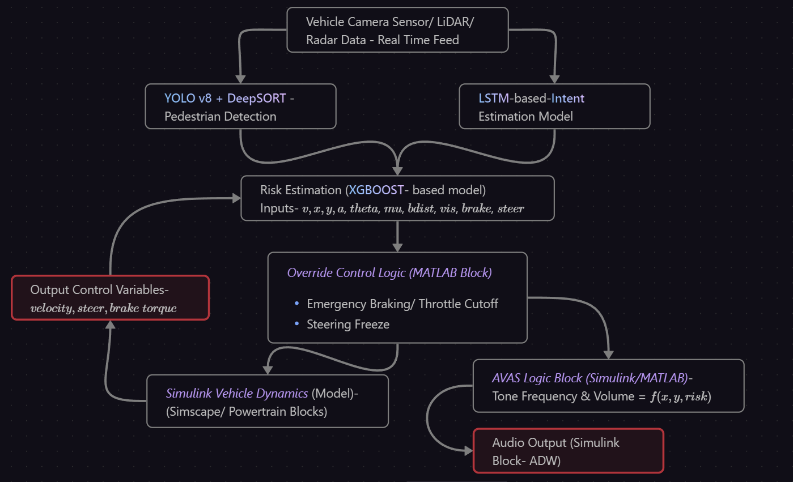
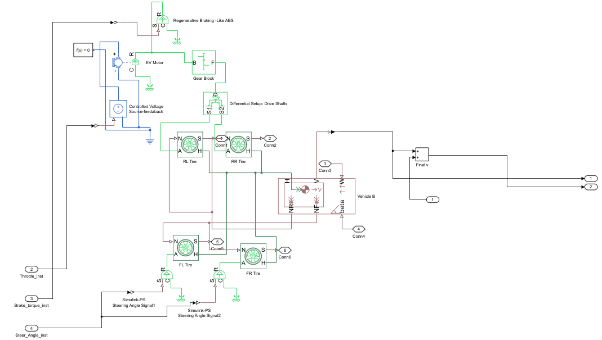
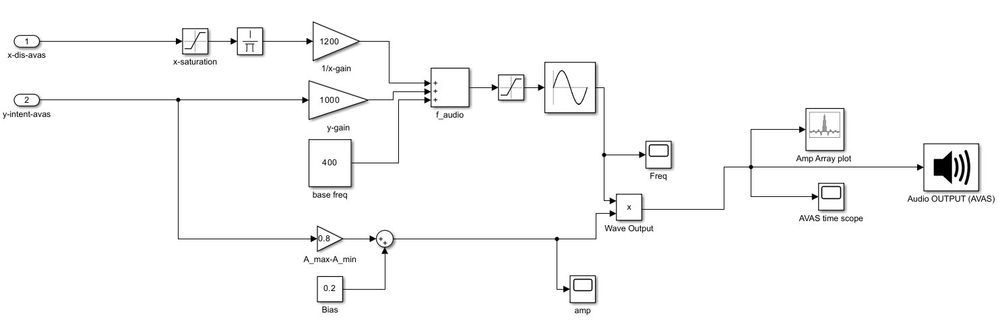
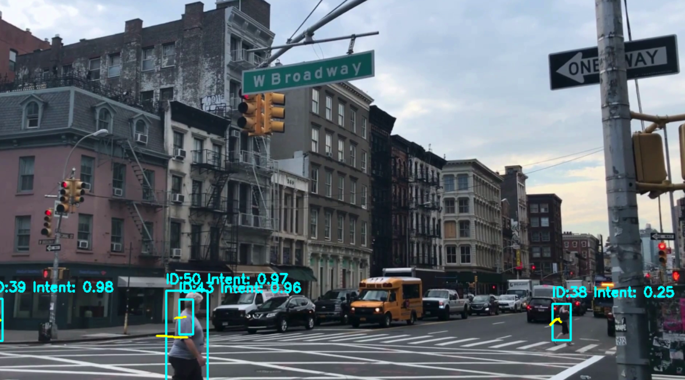
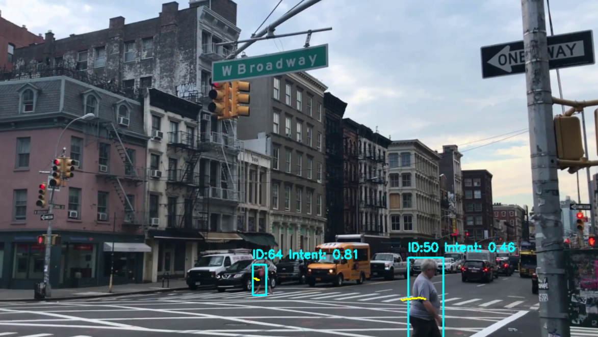
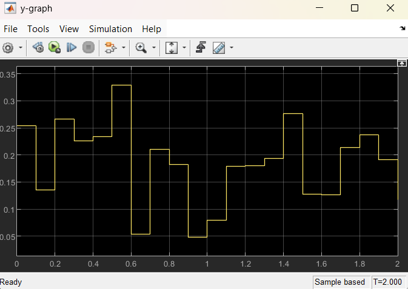
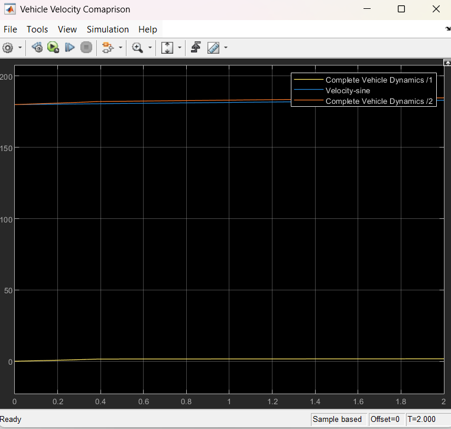
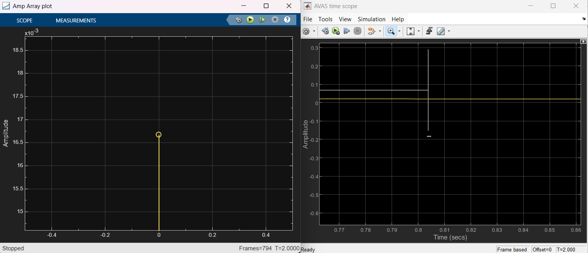

# DynamicRAISS-VehicleSafety
A dynamic perception-driven framework that proactively protects Vulnerable Road Users (VRUs)-especially pedestrians integrating real-time object detection, intent estimation, risk scoring, and control simulation into a unified safety system in EVs &amp; autonomous vehicles. Product under company--Leameng Solutions Technologies (LeSo).
The following is the Technical Product report (Unpublished draft) of the project. (Yet to be published paper)[Technical Report](https://github.com/kaustuv-d/DynamicRAISS-VehicleSafety/blob/main/DRAISS_VRU_draft02.pdf) 

# DRAISS-VRU: Dynamic Risk-Aware Intent Sensing & Simulation for Vulnerable Road Users
**Affiliations:**  
- Indian Institute of Technology Indore  
- Leameng Solution Technologies (LeSo)  

---

## 📘 Overview

**DRAISS-VRU** is a dynamic perception-driven framework that proactively protects Vulnerable Road Users (VRUs)—especially pedestrians—by integrating:

- **Real-time object detection**
- **Intent estimation**
- **Risk scoring**
- **Override control simulation**
- **Acoustic warning system**

This project simulates a unified safety system specifically designed for **Electric Vehicles (EVs)** and **Autonomous Vehicles (AVs)** using MATLAB Simulink.

> 📄 This repository hosts the **technical project files**, including:
- MATLAB `.slx` simulation model
- Python code for risk estimation
- AVAS logic design
- Technical Report (Unpublished Draft)

---

## 🎯 Key Features

### 1. **Perception Layer (YOLOv8-based)**
- Real-time pedestrian detection from camera feed using YOLOv8.
- Supports bounding box extraction and zone classification.
- Configurable for integration with LiDAR and RADAR (future upgrade).

### 2. **Intent Estimation**
- Zone-based logic (crosswalk, curbside, approach angle).
- Movement tracking to determine if a pedestrian intends to cross.

### 3. **Risk Scoring Engine**
- Python-based model using **XGBoost** classifier.
- Calculates risk levels based on velocity, intent, and proximity.
- Integrated into Simulink via MATLAB Function Block using `py.*`.

### 4. **Simulink-Based Simulation**
- Simscape vehicle modeling for kinematic behavior.
- Real-time simulation of vehicle override based on risk.
- Full vehicle path behavior simulation using input from the risk model.

### 5. **AVAS (Acoustic Vehicle Alerting System)**
- Dynamic AVAS tone modulation (volume + frequency) based on:
  - Risk level
  - Pedestrian distance
  - Intent probability
- Based on **AIS 138** standards for quiet EV pedestrian alerts.

---
## System Architecture

---
### Logic Blocks Preview
 
*Simulink Model- Vehicle Dynamics*

*AVAS (Acoustic Vehicle Alerting System ) Logic*
---
### Results 
*Pedestrian Detection & Intent Prediction*




### Testing Results 
*MATLAB results under 2 sec sample time simulation*



---

## Guide to Run
### Requirements
- MATLAB + Simulink (R2022b or later recommended)
- Python 3.8+
- Python packages: joblib, xgboost, numpy
- YOLOv8 environment (Ultralytics) for external detection/training

## Simulation Setup
- Clone this repository:
```
git clone https://github.com/kaustuv-d/DynamicRAISS-VehicleSafety.git
cd DRAISS-VRU
```
- Open the Simulink model: rwdEV_test01.slx.

- Configure Python in MATLAB (point to your Python interpreter that has xgboost):
```
pyenv('Version','<path_to_python_exe>')
```
- Place xgb_risk_model.pkl in your MATLAB working directory (or update the path in your code block).
- Confirm audio output device (for AVAS) if using the Audio Device Writer block.
- Run simulation: Press Ctrl + T (or click Run). Recommended 10–20 s test run.

## 📊 Python Risk Logic (Used in Simulink MATLAB Block)
This Python snippet is called from within a MATLAB Function block via Python integration (py.* interface):
```
import joblib
import numpy as np

# Load trained XGBoost model (multi-class: Safe, Alert, Emergency)
model = joblib.load('xgb_risk_model.pkl')

# x_input = [v, x, y, brake, steer, a, angle_to_ped, mu, vis, bdist]
risk_probs = model.predict_proba([x_input])[0]
risk_level = int(np.argmax(risk_probs))  # 0 = Safe, 1 = Alert, 2 = Emergency
```
## 📈 Results & Performance (Example Metrics)
- Real-time pedestrian detection at ~30 FPS on RTX 3070 (YOLOv8n runtime).
- Risk classification latency ~20 ms per feature update (Python XGBoost).
- AVAS tone response <50 ms from risk trigger (Simulink + audio pipeline).
- Override logic shows controlled deceleration in A2, full brake in A3 events.
- Replace these with your measured values once you log actual runs.

## 📌 Future Enhancements
- Integration with CARLA Simulator or ROS2 for hardware / HIL testing.
- LiDAR + RADAR fusion (Kalman / EKF) for robust distance + velocity estimation.
- Embedded deployment on Jetson Nano / Raspberry Pi for edge inference.
- Extend to other VRUs: cyclists, wheelchair users, and small mobility devices.
- Transformer-based deep intent prediction using pose + trajectory sequences.

## 📚 References
- AIS 138 / AIS 189 – Acoustic standards for EV pedestrian alerting (India).
- [YOLOv8 Documentation](https://docs.ultralytics.com/)
- [XGBoost Documentation]()
- MATLAB Simulink Vehicle Dynamics Toolbox (MathWorks).
- THOR-AVAS / industry AVAS concepts for EV pedestrian safety.

## Author
#### Kaustuv Devmishra
#### Final Year UG | Indian Institute of Technology Indore (IIT Indore) | Dept. of Mechanical Engineering
#### Vehicle Safety AI Intern – Leameng Solution Technologies (LeSo), Bangalore

#### 📧 Email: kaustuv2003@gmail.com
#### 🔗 LinkedIn: [Kaustuv](https://www.linkedin.com/in/kaustuv-devmishra-372868253/)


